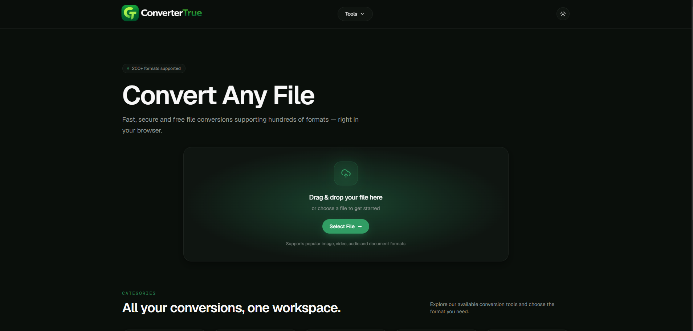
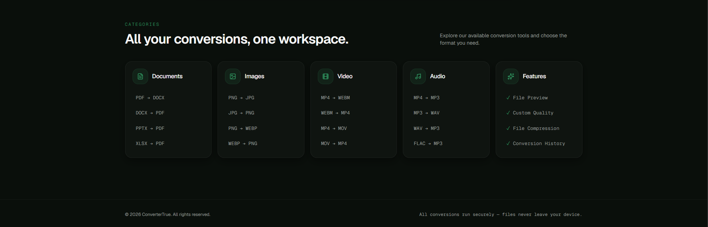

# ConverterTrue

<p align="center">
  <strong>A modern, fast, and intuitive file conversion platform.</strong>
</p>

<p align="center">
  Convert images, documents, videos, and audio files through a clean and user-friendly interface.
</p>

---



## About the Project

**ConverterTrue** is a full-stack file conversion web application designed to provide a simple and efficient way to convert files between popular formats.

The platform allows users to upload files, select a target format, process the conversion through the backend, and download the converted result.

The project was built with a clear separation between the frontend and backend. The frontend provides the user interface and conversion workflow, while the backend is responsible for receiving uploaded files and handling conversion requests through a REST API.

ConverterTrue focuses on a minimal user experience: select a file, choose the desired output format, and start the conversion.

---

## Features

- Drag-and-drop file uploading
- File selection directly from the user's device
- Multiple file conversion categories
- Image format conversion
- Document format conversion
- Video format conversion
- Audio format conversion
- Dynamic output format selection
- File conversion through a dedicated backend API
- Responsive and modern user interface
- Dark-themed design
- Light and dark theme support
- Dedicated converter pages for different file categories
- Interactive navigation with converter shortcuts
- Production-ready frontend and backend architecture

---

## Supported Conversion Categories

ConverterTrue is designed around four primary conversion categories.

### Images

Convert between commonly used image formats.

Examples:

- PNG → JPG / JPEG
- JPG / JPEG → PNG
- PNG → WEBP
- WEBP → PNG

### Documents

Convert between popular document formats.

Examples:

- PDF → DOCX
- DOCX → PDF
- PPTX → PDF
- XLSX → PDF

### Video

Convert video files into different media formats.

Examples:

- MP4 → WEBM
- WEBM → MP4
- MP4 → MOV
- MOV → MP4

### Audio

Convert audio and media files into popular audio formats.

Examples:

- MP4 → MP3
- MP3 → WAV
- WAV → MP3
- FLAC → MP3

> Available conversions depend on the formats supported by the backend conversion service.

---

## Platform Overview



The homepage provides quick access to the main conversion categories and presents commonly used format combinations.

Users can either start by uploading a file directly from the homepage or navigate to a dedicated converter through the **Tools** menu.

The application provides separate conversion workflows for:

- Image Converter
- Video Converter
- Audio Converter
- Document Converter

This structure keeps the interface simple while allowing each conversion category to handle its own supported formats.

---

## How It Works

The conversion process follows a straightforward workflow:

1. The user selects or drags a file into the application.
2. ConverterTrue detects or displays the original file format.
3. The user selects the desired output format.
4. The frontend creates a `FormData` request containing the uploaded file and target format.
5. The request is sent to the backend conversion API.
6. The backend processes the conversion request.
7. The converted file is returned to the frontend.
8. The user can download the converted result.

This architecture keeps the presentation layer separate from the conversion logic and makes the application easier to maintain and extend.

---

## Architecture

ConverterTrue uses a separated frontend and backend architecture.

```text
User
 │
 │ Upload File
 ▼
Frontend Application
React + TanStack Start
 │
 │ HTTP / REST API
 │ FormData
 ▼
Backend API
NestJS
 │
 │ File Processing
 ▼
Conversion Service
 │
 │ Converted File
 ▼
Frontend
 │
 ▼
User Download
```

### Frontend

The frontend is responsible for:

- User interface
- File selection
- Drag-and-drop interactions
- Format selection
- Conversion requests
- Conversion state handling
- Error handling
- Navigation
- Theme management

### Backend

The backend is responsible for:

- Receiving uploaded files
- Handling conversion API requests
- Processing file conversion operations
- Managing conversion responses
- Returning converted files to the client
- Handling CORS between the frontend and backend deployments

---

## Tech Stack

### Frontend

- React
- TypeScript
- TanStack Start
- TanStack Router
- TanStack Query
- Vite
- Tailwind CSS
- Motion
- Lucide React

### Backend

- Node.js
- NestJS
- TypeScript
- REST API
- Multipart / FormData file handling

### Deployment

- Vercel — Frontend deployment
- Railway — Backend API deployment
- GitHub — Source control and repository hosting

---

## Project Structure

```text
ConverterTrue/
│
├── backend/
│   ├── src/
│   │   ├── converter/
│   │   └── ...
│   ├── package.json
│   └── ...
│
├── public/
│   ├── favicon.png
│   └── navfoto.png
│
├── screenshots/
│   ├── homepage.png
│   └── home2.png
│
├── src/
│   ├── components/
│   ├── converter/
│   ├── hooks/
│   ├── lib/
│   │   └── api/
│   ├── routes/
│   │   ├── audio-converter.tsx
│   │   ├── document-converter.tsx
│   │   ├── image-converter.tsx
│   │   ├── video-converter.tsx
│   │   └── index.tsx
│   ├── types/
│   ├── router.tsx
│   ├── server.ts
│   ├── start.ts
│   └── styles.css
│
├── .env
├── package.json
├── tsconfig.json
├── vite.config.ts
└── README.md
```

---

## API Communication

The frontend communicates with the backend using an environment variable:

```env
VITE_API_URL=YOUR_BACKEND_API_URL
```

Conversion requests are sent to:

```text
POST /api/convert
```

The frontend sends files using `FormData`.

Example request structure:

```ts
const formData = new FormData();

files.forEach((file) => {
  formData.append("files", file);
});

formData.append("outputFormat", outputFormat);

const response = await fetch(
  `${import.meta.env.VITE_API_URL}/api/convert`,
  {
    method: "POST",
    body: formData,
  }
);
```

Using an environment variable keeps the API configuration independent from the frontend source code and allows different backend URLs to be used in development and production.

---

## Local Development

### 1. Clone the repository

```bash
git clone https://github.com/Bedirhanelcik/convertertrue.git
```

Navigate to the project:

```bash
cd convertertrue
```

### 2. Install frontend dependencies

```bash
npm install
```

### 3. Configure environment variables

Create a `.env` file in the project root:

```env
VITE_API_URL=http://localhost:3000
```

### 4. Start the frontend

```bash
npm run dev
```

### 5. Start the backend

Open another terminal and navigate to the backend:

```bash
cd backend
```

Install dependencies:

```bash
npm install
```

Start the NestJS development server:

```bash
npm run start:dev
```

The frontend can now communicate with the locally running backend.

---

## Deployment Architecture

ConverterTrue uses independent deployments for the frontend and backend.

```text
GitHub Repository
       │
       ├───────────────┐
       │               │
       ▼               ▼
    Vercel          Railway
   Frontend         Backend
       │               │
       └──── API ───────┘
```

The frontend is deployed independently from the backend. The production backend URL is provided to the frontend through the `VITE_API_URL` environment variable.

This architecture provides a clean separation of concerns and allows both parts of the application to be deployed and maintained independently.

---

## Design

ConverterTrue uses a minimal dark interface with green accent colors to create a focused conversion experience.

The interface was designed around several principles:

- Clear visual hierarchy
- Minimal interaction steps
- Simple file upload workflow
- Easy access to conversion tools
- Consistent visual language
- Responsive layout
- Fast navigation between converter categories

The goal is to keep file conversion straightforward without unnecessary UI complexity.

---

## Future Improvements

Potential future improvements include:

- Batch file conversion
- Conversion history
- File compression controls
- Custom image quality settings
- Advanced video quality settings
- File preview before conversion
- Conversion progress indicators
- Additional file formats
- Improved large-file handling
- User accounts and saved conversion history
- Cloud storage integrations

---

## Repository

The complete source code is available in this repository.

The project contains both the frontend application and the backend conversion API, organized as separate parts of the same codebase.

---

## Author

## Author

**Bedirhan Elçik**

Management Information Systems Student & Software Developer

- GitHub: [Bedirhanelcik](https://github.com/Bedirhanelcik)
- LinkedIn: [Bedirhan Elçik](https://www.linkedin.com/in/bedirhanelcik/)

---

## License

This project was developed for educational and portfolio purposes.

---

<p align="center">
  Built with React, TypeScript, TanStack Start and NestJS.
</p>

<p align="center">
  <strong>ConverterTrue — Convert Any File, Fast & Free.</strong>
</p>
